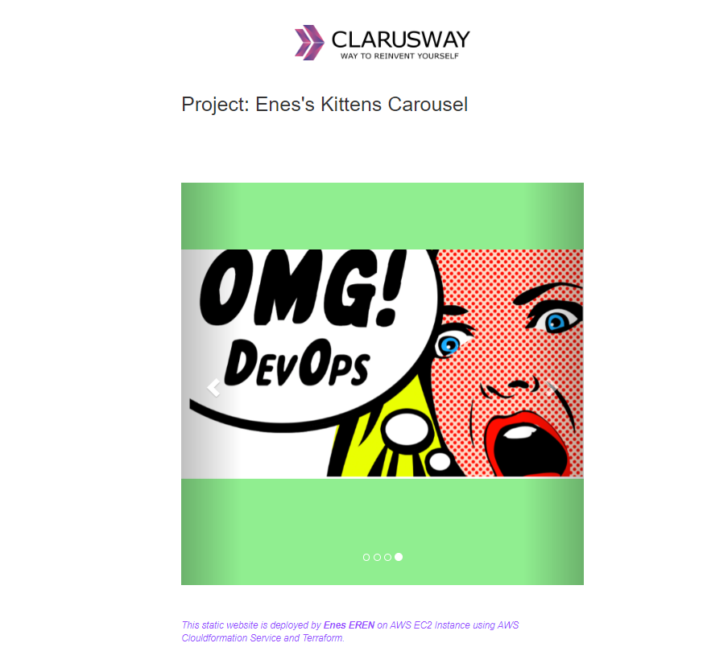

# Kittens Carousel Static Website deployed on AWS EC2 using Terraform 

## Description
Kittens Carousel is a static website application deployed with Apache Web Server on AWS Elastic Compute Cloud (EC2) Instance using Terraform 

## Expected Outcome

### At the end of the project, following topics are to be covered;

- Apache Web Server Installation on Linux

- Static Website Deployment

- Bash scripting

- AWS EC2 Service

- AWS Security Groups Configuration

- AWS Cloudformation Service 

- Terraform Information about AWS resources

- Git & Github for Version Control System

### At the end of the project, students will be able to;

- install Apache Web Server on Amazon Linux 2.

- configure AWS EC2 Instance and Security Groups.

- configure main.tf template to use AWS Resources.

- use AWS Cloudformation Service to launch stacks.

- use git commands (push, pull, commit, add etc.) and Github as Version Control System.

## Steps to Solution
  
- Step 1: Download or clone project definition from `clarusway` repo on Github 

- Step 2: Create project folder for local public repo on your pc

- Step 3: Prepare a main.tf template to deploy your app on EC2 Instance

- Step 4: Push your application into your own public repo on Github

- Step 5: Use terraform commands to build it and display static website

## Notes

- Customize the application by hard-coding your name instead of `student_name` within `index.html`.

## Resources

- https://registry.terraform.io/